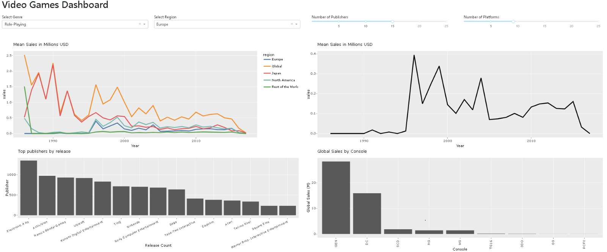

# Game Sales Dashboard

Game Sales is an interactive dashboard that allows users to easily visualize and filter high level sales information from the video games industry.

* [Purpose](#Purpose)
* [Overview](#Overview)
* [Sketch](#Sketch)
* [App description](#App-description)
* [Usage](#Usage)
* [Online](#Online)
* [Local](#Local)
* [Want to get involved?](#Want-to-get-involved?)
* [What we need](#What-we-need)
* [Contact](#Contact)

## Purpose

The gaming industry has been getting a lot of attention in recent years. What started as a relatively niche industry within entertainment sector has grown to eclipse the combined revenues of film and sports combined. This growth continues to attract new investors and developers alike, who are faced with the daunting task of navigating the complex landscape of companies, consoles, genres and regions that encapsulate the industry. This is where we come in. The game_sales dashboard allows relative newcomers to quickly perform high level analysis on the gaming industry without the need for programming experience or a costly data platform subscription.

# Overview

### Sketch



## App description

The `game_sales` app contains a landing page that displays crucial information of the [Video Game Sales](https://www.kaggle.com/gregorut/videogamesales) dataset. The app focuses on analyzing sales trends and the ranking of the most popular video game publishers.

The visualizations shown by the app include :

- A line plot showing the evolution of global video game sales by its genre. The sales(lines) in the chart will be coloured according to the genre.

- Similarly, another line plot that shows the evolution of video game sales by region. Our dashboard analyzes sales by four regions; North America, Japan, Europe and the Rest of the world. The user can select global sales as well. The sales in the chart will be coloured according to the region.

- A bar chart showing the top publishers with the highest sales of video games.

The app includes a panel to help the user to filter the data and add functionality to the dashboard. 

The panel includes:

- Multiple selection boxes to filter out the video game sales by genre and region.

- Multiple selection box that allows the user to change the number of publishers considered in the ranking of the bar plot.

Users will be able to observe the evolution of sales of the video game industry and get insights into its trends by genre, publisher and region.


# Usage

## Online

Using our app online is as easy as clicking the Heroku [link](https://dsc-532-game-sales-dashr.herokuapp.com/)!

## Run the app locally

After cloning this [repository](https://github.com/UBC-MDS/game_sales_dashr.git) follow the instructions to run the app locally:

In the terminal inside the project directory:

```

# Install the R packages required 
Rscript init.R

# Run Dash
Rscript app.R

```
Finally, open the app in the following URL http://localhost:8000/


# Want to get involved?

Have an idea/contribution that you would like to see implemented? The more the merrier!

Contributors can add to this project by creating a fork from the project [repository](https://github.com/UBC-MDS/game_sales_dashr.git) and submitting a pull request with their proposed additions/changes. Also be sure to check out our [contributing guidelines](https://github.com/UBC-MDS/game_sales_dashr/blob/main/CONTRIBUTING.md)

## What we need

Contributors are welcome to add to the project in whatever way they like.

Some specific things we feel could add tremendous value are:
- Functionality to automatically update the dataset as figures change year-to-year.
- Visual design.
- More advanced plotly functionality.

## Contact

Please reach out any member of the [team](https://github.com/UBC-MDS/game_sales_dashr/blob/main/CODE_CONDUCT.md#project-team)
